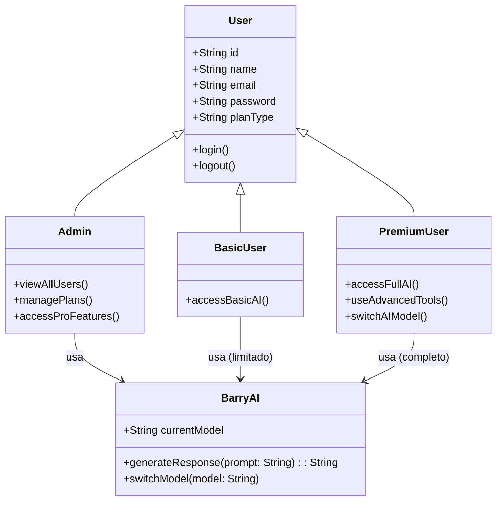
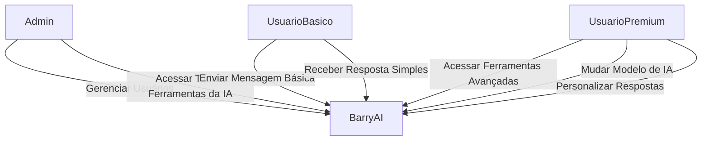
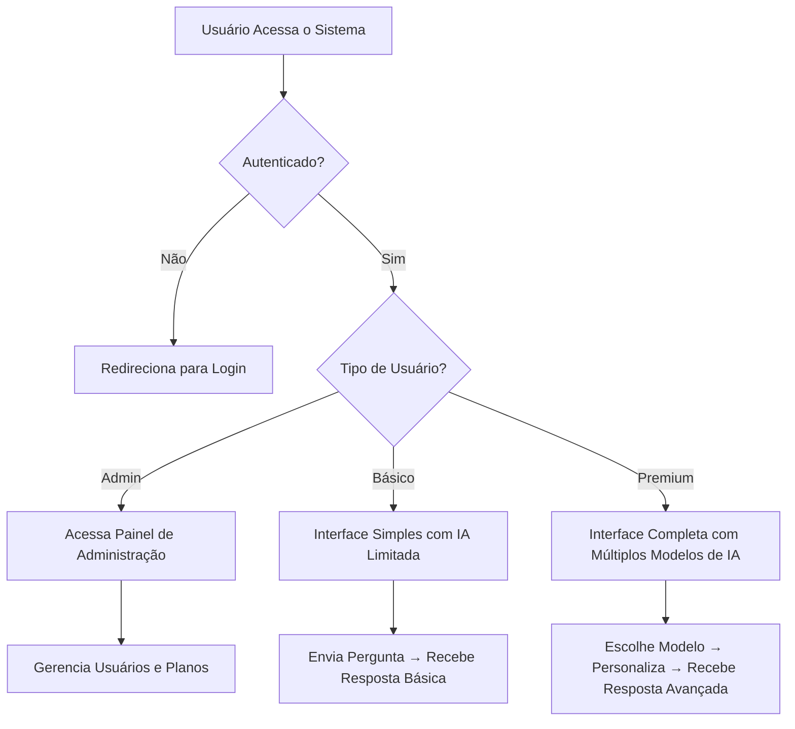

<div align="center">


</div>

> **Uma IA acessível para todos.**

BarryAI é um **chatbot inteligente** desenvolvido com foco em **usabilidade e inclusão digital**. Projetado especialmente para usuários que enfrentam barreiras no uso de tecnologias, BarryAI oferece uma interface simples, intuitiva e poderosa, com diferentes níveis de acesso conforme o plano do usuário.


---

## 🧩 Problematização
Em um mundo cada vez mais digital, o acesso à tecnologia tornou-se essencial para a participação plena na sociedade. No entanto, muitas pessoas ainda enfrentam grandes dificuldades em lidar com ferramentas tecnológicas, seja por falta de familiaridade, limitações físicas ou cognitivas, ou pela complexidade das interfaces disponíveis. Essa exclusão digital impede que esses indivíduos usufruam de serviços básicos, como comunicação, educação e atendimento público, ampliando desigualdades sociais já existentes.

Esse desafio é particularmente visível em diferentes faixas etárias e perfis cognitivos. Entre os mais jovens, por exemplo, 65% das crianças e adolescentes no Brasil já utilizam inteligência artificial generativa para estudar, criar conteúdo e até lidar com emoções — um indicativo de que a tecnologia está profundamente integrada às suas rotinas. No entanto, com cerca de 15,9 milhões de crianças e adolescentes conectados no país (Cetic.br, 2025), é crucial garantir que essa imersão digital seja acompanhada de suporte adequado, especialmente para aqueles com dificuldades cognitivas, como o Transtorno do Déficit de Atenção com Hiperatividade (TDAH), que afeta globalmente cerca de 7,2% das crianças e adolescentes — o equivalente a aproximadamente 186 milhões de pessoas (Polanczyk et al., 2015).

Já entre os idosos, a relação com a tecnologia é mais ambivalente. Embora mais da metade (55%) dos norte-americanos com mais de 50 anos já tenha usado IA ao menos uma vez — especialmente por meio de assistentes de voz como a Alexa —, há uma divisão clara quanto à confiança nessa tecnologia: 54% confiam na IA, enquanto 46% não confiam, segundo pesquisa analisada pela professora Robin Brewer, da Universidade de Michigan (Olhar Digital, 2025). Essa desconfiança, somada à dificuldade em identificar conteúdos imprecisos gerados por IA, revela a necessidade de interfaces mais transparentes, acessíveis e adaptadas às suas capacidades cognitivas e sensoriais.

Além disso, estima-se que 154 milhões de adultos vivam com TDAH em todo o mundo (Fayyad et al., 2017), muitos deles sem diagnóstico. Para essas pessoas, interfaces complexas, excesso de estímulos visuais ou linguagem técnica podem representar barreiras significativas à inclusão digital. Diante desse cenário, torna-se urgente desenvolver soluções tecnológicas mais acessíveis e intuitivas — como inteligências artificiais com design inclusivo, linguagem clara, feedback auditivo e suporte empático — que possibilitem a inclusão digital e a autonomia de todos, independentemente da idade ou condição cognitiva.

Assim, a tecnologia deixa de ser uma barreira e passa a ser um instrumento de apoio, empatia e transformação social — capaz não apenas de conectar, mas de compreender, adaptar-se e incluir.

## 🎯 Objetivo

Tornar a interação com inteligência artificial **acessível, segura e produtiva** para pessoas de todas as idades e níveis de dificuldade em relação a tecnologia tecnologia.

---

## 👥 Tipos de Usuários

| Tipo de Usuário      | Acesso                                                                 |
|----------------------|------------------------------------------------------------------------|
| **Admin**            | - Gerencia todos os usuários (básico e premium)<br>- Acesso total ao sistema<br>- Pode visualizar métricas, logs e gerenciar planos |
| **Usuário Básico**   | - Acesso limitado às funcionalidades da IA<br>- Interface simplificada<br>- Sem acesso a ferramentas avançadas |
| **Usuário Premium**  | - Acesso completo às funcionalidades da IA<br>- Integração com múltiplos modelos (ChatGPT, Qwen, Gemini, Copilot)<br>- Recursos avançados de personalização<br>- Acesso a criação de imagens com o BarryAi |

---

## 📋 Requisitos do Sistema — BarryAI

### ✅ Requisitos Funcionais (RF)

| ID  | Descrição |
|-----|----------|
| **RF-01** | O sistema deve permitir o cadastro de novos usuários com nome, e-mail e senha. |
| **RF-02** | O sistema deve permitir o login seguro com autenticação por e-mail e senha. |
| **RF-03** | O sistema deve diferenciar três tipos de usuários: **Admin**, **Usuário Básico** e **Usuário Premium**. |
| **RF-04** | O **Admin** deve poder visualizar, editar e excluir contas de todos os usuários (básicos e premium). |
| **RF-05** | O **Admin** deve ter acesso total a todas as funcionalidades da IA (modelos, histórico, configurações). |
| **RF-06** | O **Usuário Básico** deve poder interagir com o BarryAI, mas com funcionalidades limitadas (ex: respostas simples, sem personalização). |
| **RF-07** | O **Usuário Premium** deve ter acesso completo às funcionalidades da IA, incluindo troca de modelo (ChatGPT, Qwen, Gemini, Copilot), histórico detalhado e respostas avançadas. |
| **RF-08** | O sistema deve permitir que o usuário premium selecione qual modelo de IA deseja usar em cada interação. |
| **RF-09** | O sistema deve registrar o histórico de conversas do usuário (com data e modelo usado) e permitir sua visualização (apenas para o próprio usuário e admin). |
| **RF-10** | O sistema deve oferecer uma interface visual simples, com linguagem clara e ícones intuitivos, voltada para usuários com pouca familiaridade com tecnologia. |
| **RF-11** | O sistema deve validar e-mails e senhas fortes durante o cadastro. |
| **RF-12** | O sistema deve permitir a atualização de plano (básico → premium) diretamente pela interface. |

---

### 🛡️ Requisitos Não Funcionais (RNF)

| ID   | Categoria | Descrição |
|------|----------|----------|
| **RNF-01** | **Usabilidade** | A interface deve ser intuitiva o suficiente para que um usuário leigo consiga interagir com o BarryAI sem ajuda técnica. |
| **RNF-02** | **Acessibilidade** | O sistema deve seguir diretrizes WCAG 2.1 (ex: contraste adequado, navegação por teclado, leitores de tela compatíveis). |
| **RNF-03** | **Desempenho** | O tempo de resposta da IA não deve exceder **5 segundos** em 95% das requisições (em condições normais de rede). |
| **RNF-04** | **Segurança** | Todas as senhas devem ser armazenadas com hash (bcrypt). A autenticação deve usar JWT com tempo de expiração. |
| **RNF-05** | **Privacidade** | O histórico de conversas deve ser privado e criptografado em trânsito (HTTPS) e em repouso (MongoDB com criptografia opcional). |
| **RNF-06** | **Confiabilidade** | O sistema deve ter disponibilidade mínima de **99%** durante o horário comercial (8h–22h). |
| **RNF-07** | **Escalabilidade** | A arquitetura deve suportar até **10.000 usuários ativos simultâneos** com mínima degradação de desempenho. |
| **RNF-08** | **Compatibilidade** | O frontend deve funcionar corretamente nos navegadores: Chrome, Firefox, Edge e Safari (últimas 2 versões). |
| **RNF-09** | **Manutenibilidade** | O código deve seguir boas práticas (naming, comentários, modularização) e incluir testes unitários para rotas críticas. |
| **RNF-10** | **Internacionalização** | A interface deve suportar pelo menos **português (BR)** e **inglês**, com possibilidade de expansão futura. |

---

## 💡 Observações

- Os requisitos foram definidos com foco em **inclusão digital** e **experiência do usuário leigo**.
- A diferenciação clara entre planos (básico vs. premium) garante **monetização** e **valor percebido**.
- A integração com múltiplos modelos de IA oferece **flexibilidade** e **resiliência** (se uma API falhar, outra pode ser usada).

---

## 🛠️ Tecnologias Utilizadas

### Backend (Python + Node.js)
- **Python**: Lógica principal da IA (integração com modelos de linguagem)
- **Node.js + Express**: Servidor da API
- **MongoDB + Mongoose**: Banco de dados não relacional
- **JWT + Bcrypt**: Autenticação e criptografia de senhas
- **Express Validator**: Validação de requisições
- **Nodemon**: Reinicialização automática durante o desenvolvimento

### Frontend (Angular)
- **Angular CLI**: Estrutura do projeto
- **RxJS**: Gerenciamento de estados e streams assíncronos
- **AuthGuard**: Proteção de rotas por nível de acesso
- **JSON**: Formato de troca de dados

### Ferramentas & Outros
- **Figma**: Prototipagem de interface
- **Microsoft Word**: Documentação detalhada
- **README.md**: Documentação técnica e de uso
- **Modelos de IA**: ChatGPT, Qwen, Gemini, GitHub Copilot (via APIs)

---

## 📊 Diagramas

### 1. Diagrama de Classes



---

### 2. Diagrama de Casos de Uso




---

### 3. Diagrama de Fluxo de Interação



---

## 🚀 Como Rodar o Projeto

### Pré-requisitos
- Node.js (v18+)
- Python 3.9+
- MongoDB (local ou Atlas)
- Contas nas APIs de IA (ChatGPT, Qwen, Gemini, etc.)

### Backend
```bash
cd backend
npm install
npm run dev  
```

### Frontend
```bash
cd frontend
npm install
ng serve
```

---

## 📜 Licença

Este projeto é privado e de propriedade da equipe de desenvolvimento MVMP. Todos os direitos reservados.  
